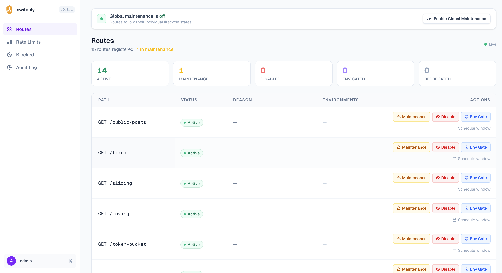

# Route Control

Waygate gives you five decorators to control how a route behaves at runtime. Apply them once in code, then change state without touching code or restarting the server.

---

## The decorators at a glance

| Decorator | HTTP status | When to use |
|---|---|---|
| `@maintenance(reason)` | 503 with `Retry-After` | Temporarily taking a route offline |
| `@disabled(reason)` | 503 | Permanently decommissioning a route |
| `@env_only("staging", "dev")` | 404 in unlisted environments | Hiding a route outside specific envs |
| `@deprecated(sunset, use_instead)` | 200 + deprecation headers | Signalling a route will be removed |
| `@force_active` | Always 200, bypasses all checks | Pinning a route open regardless of global state |

---

## `@maintenance`

Takes a route offline temporarily. Every caller receives a 503 until the route is re-enabled.

```python
from waygate.fastapi import maintenance

@router.get("/payments")
@maintenance(reason="Payment provider maintenance - back at 04:00 UTC")
async def get_payments():
    return {"payments": []}
```

Response:

```http
HTTP/1.1 503 Service Unavailable
Retry-After: 1800
```

```json
{
  "error": {
    "code": "MAINTENANCE_MODE",
    "message": "This endpoint is temporarily unavailable",
    "reason": "Payment provider maintenance - back at 04:00 UTC",
    "path": "GET:/payments",
    "retry_after": "2025-06-01T04:00:00Z"
  }
}
```

### Scheduled maintenance window

Pass `start` and `end` to activate and deactivate automatically. The route returns to active when the window closes.

```python
from datetime import UTC, datetime, timedelta

@router.get("/checkout")
@maintenance(
    reason="Scheduled upgrade",
    start=datetime(2025, 6, 1, 3, 0, tzinfo=UTC),
    end=datetime(2025, 6, 1, 4, 0, tzinfo=UTC),
)
async def checkout():
    return {"checkout": "ok"}
```

You can also schedule windows at runtime without changing code:

```bash
waygate schedule GET:/checkout \
    --reason "Scheduled upgrade" \
    --start "2025-06-01T03:00:00Z" \
    --end   "2025-06-01T04:00:00Z"
```

---

## `@disabled`

Permanently blocks a route with a 503. Unlike `@maintenance`, there is no `retry_after` timestamp because the route is not expected to come back.

```python
from waygate.fastapi import disabled

@router.get("/v1/legacy-endpoint")
@disabled(reason="Removed in v2. Use /v2/endpoint instead.")
async def legacy():
    return {}
```

Response:

```json
{
  "error": {
    "code": "ROUTE_DISABLED",
    "message": "This endpoint has been disabled",
    "reason": "Removed in v2. Use /v2/endpoint instead.",
    "path": "GET:/v1/legacy-endpoint"
  }
}
```

---

## `@env_only`

Restricts a route to specific environments. Callers in unlisted environments receive a 404.

```python
from waygate.fastapi import env_only

@router.post("/admin/seed-database")
@env_only("development", "staging")
async def seed():
    return {"seeded": True}
```

Waygate reads the current environment from `WAYGATE_ENV` (defaults to `"dev"`).

```bash
WAYGATE_ENV=staging uvicorn app:app      # route is accessible
WAYGATE_ENV=production uvicorn app:app   # route returns 404
```

The route is also hidden from `/docs` when the current environment is not in the allowed list.

---

## `@deprecated`

The route still works and returns 200, but every response includes deprecation headers.

```python
from waygate.fastapi import deprecated

@router.get("/v1/users")
@deprecated(
    sunset="2025-12-31",
    use_instead="/v2/users",
)
async def list_users_v1():
    return {"users": []}
```

Every response includes:

```http
Deprecation: true
Sunset: 2025-12-31
Link: </v2/users>; rel="successor-version"
```

These headers follow the [HTTP Deprecation](https://datatracker.ietf.org/doc/html/draft-ietf-httpapi-deprecation-header) and [Sunset](https://www.rfc-editor.org/rfc/rfc8594) standards. Most HTTP clients and API gateways surface them automatically.

---

## `@force_active`

Pins a route permanently open, bypassing all waygate checks including global maintenance mode. Suitable for health checks, readiness probes, and internal status endpoints.

```python
from waygate.fastapi import force_active

@router.get("/health")
@force_active
async def health():
    return {"status": "ok"}
```

This route always returns 200, even when `engine.enable_global_maintenance()` is active.

---

## Combining decorators

`@force_active` and `@deprecated` can be combined with `@maintenance` or `@disabled`. Apply `@force_active` outermost so it takes effect regardless of the other decorator:

```python
@router.get("/health")
@force_active
@deprecated(sunset="2025-12-31", use_instead="/v2/health")
async def health_v1():
    return {"status": "ok"}
```

Rate limiting stacks with any lifecycle decorator. The lifecycle check runs first, so a route in maintenance never consumes quota:

```python
from waygate.fastapi import maintenance, rate_limit

@router.get("/checkout")
@maintenance(reason="Upgrade in progress")
@rate_limit("20/minute")
async def checkout():
    return {"ok": True}
```

---

## Runtime control

Route state can be changed at runtime with no code changes and no server restart.

### Via the engine

```python
await engine.set_maintenance("GET:/payments", reason="Hotfix")
await engine.enable("GET:/payments")
await engine.disable("GET:/payments", reason="Deprecated")

from datetime import UTC, datetime, timedelta
await engine.schedule_maintenance(
    "GET:/checkout",
    reason="Upgrade",
    start=datetime.now(UTC) + timedelta(hours=1),
    end=datetime.now(UTC) + timedelta(hours=2),
)
```

### Via the CLI

```bash
waygate maintenance GET:/payments --reason "Hotfix"
waygate enable GET:/payments
waygate disable GET:/payments --reason "Deprecated"
waygate schedule GET:/checkout \
    --reason "Upgrade" \
    --start "2025-06-01T03:00:00Z" \
    --end   "2025-06-01T04:00:00Z"
```

### Via the dashboard

The **Routes** tab lists every registered route with its current status. Click the status badge to toggle it, or open the route detail view to set a scheduled window or maintenance reason.



---

## How the checks run

For every request, the middleware checks in this order:

1. `@force_active` route? Pass through.
2. Global maintenance active? Return 503.
3. Route in `MAINTENANCE`? Return 503.
4. Route `DISABLED`? Return 503.
5. Route `ENV_GATED` and wrong environment? Return 404.
6. Route `DEPRECATED`? Pass through and inject headers.
7. Rate limit policy registered? Check and either pass or return 429.

---

## Next step

[**Tutorial: Adding Middleware**](middleware.md)
